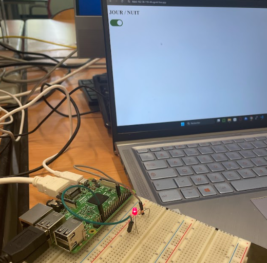
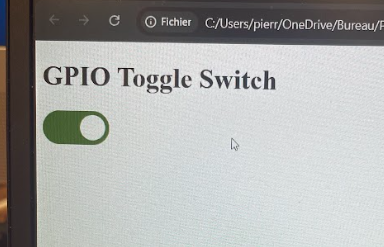
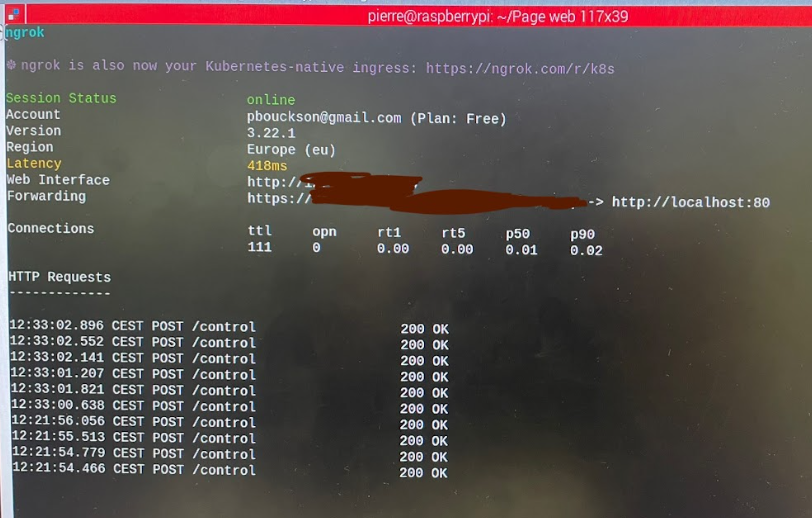

# GPIO Web Control – Raspberry Pi

Hi,

This repository shows you how to control a Raspberry Pi’s GPIO using a simple web interface.  
It has many applications in home automation and demonstrates the basics of building a lightweight web server with Python.



## Repository Structure

- `app.py` – Python script (Flask server)
- `templates/` – Contains the `index.html` page
- `images/` – Project screenshots

## Required Equipment

1. Raspberry Pi 3 (or later) with Raspbian OS installed
2. LED + 330Ω resistor
3. Keyboard, mouse, monitor (or SSH)

## Tools Used

- Raspbian OS
- Ngrok (to make the server accessible from anywhere)

## Project Overview

This project lets you control your Raspberry Pi from anywhere using a web page.

You can toggle a LED connected to GPIO 17 by simply clicking a switch in your browser.

## Web Interface



- The web page is simple and contains a single toggle button.
- It sends a POST request with the value `on` or `off` using the `action` parameter.
- You can preview it by opening `index.html` in the `templates/` folder.

## How to Run the Project

### Install Python Libraries

Make sure your system is up to date and install dependencies:

```bash
sudo apt update
sudo apt install python3-pip -y
pip install flask RPi.GPIO
```

### Clone the Repository

```bash
mkdir GPIO_Web_Control
cd GPIO_Web_Control
git clone git@github.com:pierre-bouckson/gpio-web-control.git
```

### Run the Python Server

Open a terminal and run the Flask app (use `sudo` to access GPIO):

```bash
sudo python3 app.py
```

## Make It Public with Ngrok

### Step 1 – Set up Ngrok

1. Create a free account at https://ngrok.com  
2. Copy your authtoken from the dashboard  
3. Configure it on your Raspberry Pi:

```bash
ngrok config add-authtoken YOUR_AUTHTOKEN
```

### Step 2 – Start the Tunnel

In a separate terminal (Flask must still be running), start the tunnel:

```bash
ngrok http 80
```

Ngrok will give you a public HTTPS address like:

```
https://4de5-56... .ngrok-free.app
```

You can now access your Raspberry Pi's web page from anywhere with the https adress — including mobile networks (4G/5G).



## You're Done

Your web server is now accessible both locally and remotely.  
You can use the toggle switch on the web page to turn the LED on or off via GPIO 17.


## License

This project is open-source. Use it freely and adapt it to your needs.